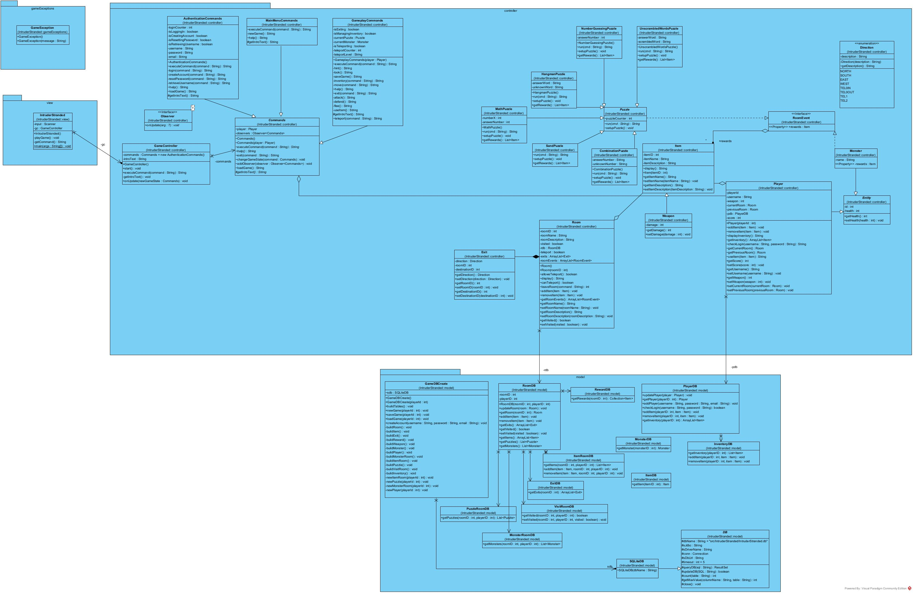

# Intruder Stranded
## Text-based adventure game created to client specifications

### UML Class Diagram:

## Installation Instructions:
### 1. Clone the repository
### 2. You will need to add sqlite jdbc driver to the project (it is included with this repo for your convenience)
### 3. You will need JUnit if running the tests. If you do not know how to set up JUnit in your project, feel free to remove the test files from your local clone if you are just testing out the game